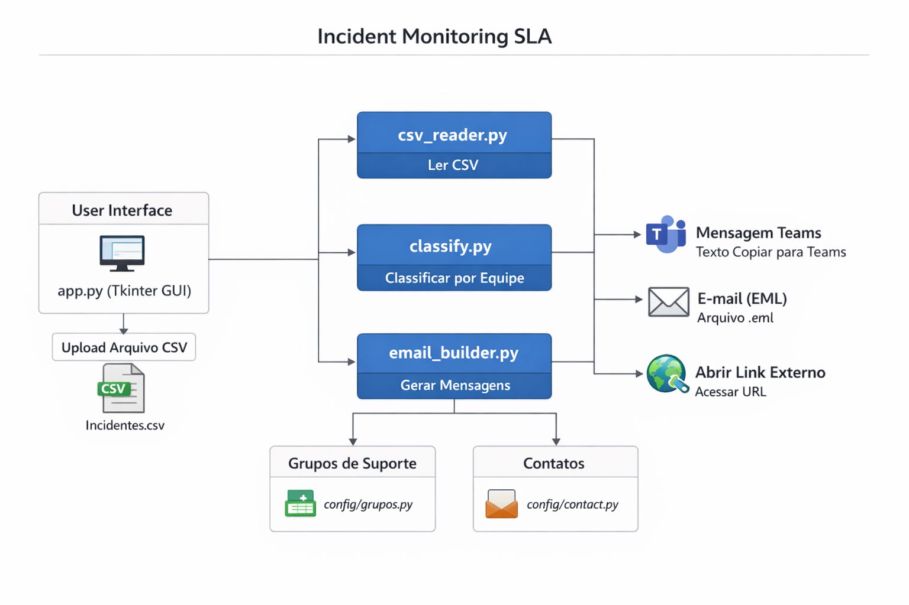

# 🧭 Monitoramento de SLA — Ferramenta de Automação (Versão Genérica)

📊 Automação completa para monitoramento de incidentes, geração de mensagens profissionais e criação de e‑mails automáticos com assinatura embutida.

Este projeto foi criado com base em uma solução real utilizada em ambiente corporativo, porém aqui está disponibilizado em uma versão **100% genérica e segura**, ideal para estudo, portfólio e demonstração profissional.

---

## ✅ Funcionalidades

- 📤 Importação e leitura de CSV  
- 🗂️ Classificação automática de incidentes por grupo de suporte  
- 💬 Geração de mensagem pronta para Microsoft Teams  
- ✉️ Criação de e‑mails `.eml` com:  
  - Template profissional  
  - Saudação automática  
  - Assinatura **inline** 
- 🔗 Abertura de links de consulta diretamente do app  
- 🎨 Interface gráfica desenvolvida em Tkinter

---

## 🚀 Como Executar

```bash
git clone https://github.com/luktts/Monitoramento_SLA.git
cd Monitoramento_SLA
python app.py
```

💡 Certifique‑se de que você tem Python 3+ instalado.

---

## 🧱 Arquitetura



---

## 🗂️ Estrutura do Projeto

```
Monitoramento_SLA/
│
├── app.py
├── incident_generic.csv        # Arquivo CSV de exemplo para testes
├── README.md
│
├── config/
│   ├── contact.py              # Contatos fictícios (manager / leader)
│   └── grupos.py               # Estrutura dos grupos de suporte
│
├── docs/
│   └── arquitetura.png         # Diagrama da arquitetura
│
├── emails/
│   ├── emails_sends/           # Saída dos emails gerados (.eml)
│   └── template/
│       ├── assinatura.png      # Assinatura INLINE para email
│       └── template.txt        # Template de email dinâmico
│
└── logic/
    ├── classify.py             # Classificação de incidentes
    ├── csv_reader.py           # Leitura do CSV
    └── email_builder.py        # Geração de emails e mensagens
```

---

## 📄 Exemplo de CSV

O projeto inclui um arquivo pronto para testes:

📁 **`incident_generic.csv`**

Exemplo simplificado:

```csv
number,short_description,assignment_group
INC200001,Hardware Display Issue,Servidores-Support
INC200002,App Crash,Support-Usuario
INC200003,Network Slowness,Telecom-Support
```

---

## ✉️ Template de E-mail

```txt
{saudacao}, {primeiro_nome_lider}.

Esta é uma mensagem automática.

Segue a atualização dos incidentes do grupo {equipe}:

{lista_incidentes}

Consulta completa:
{inc_link}

Atenciosamente,
Equipe de Monitoramento SLA
```

---

## 📘 Tecnologias Utilizadas

- Python 3  
- Tkinter  
- Bibliotecas padrão (csv, email.mime)  
- Arquitetura modular  
- CSV como fonte de dados  

---

## ⭐ Contribuições

Pull requests são bem-vindos!  
Sugestões de melhorias também são apreciadas.

---

## 💬 Gostou do projeto?

Deixe uma estrela ⭐ no repositório!  
Isso me ajuda muito no GitHub e no LinkedIn. 😊
